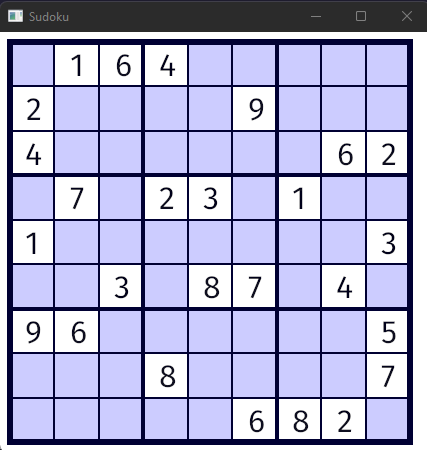

# Sudoku

A simple Sudoku game made with [rust](https://www.rust-lang.org/) and [piston](https://github.com/PistonDevelopers/piston)

This game is a sample and showing my learning in the rust language. For more information view the [tutorial](https://github.com/PistonDevelopers/Piston-Tutorials/tree/master/sudoku) I followed to make this game!

## Example

## Running Yourself

To run the game you need to have a rust development enviroment install on your computer. 

Steps:

1. `git clone https://github.com/ThatGuyJamal/Learning-Code`
2. `cd rust\learn\sudoku`
3. `cargo build`
4. `cargo run`